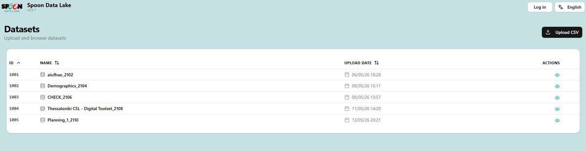
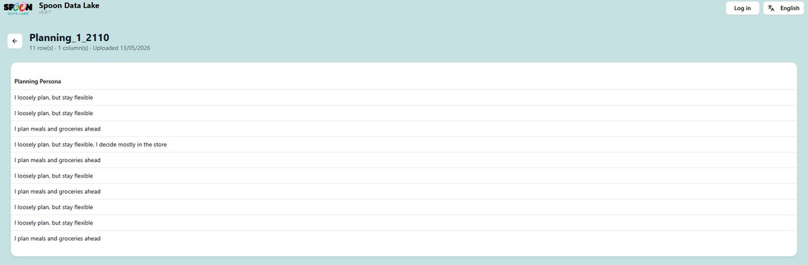

# Spoon Data Lake

## Overview

The **Spoon Data Lake** (v0.0.7) at [lake.datau.jibe.cloud](https://lake.datau.jibe.cloud) is the
centralised data repository for the SPOON research programme. A Jibe-owned component and a key
deliverable of Work Package 2, DataLake v1.0 was completed in **March 2026**. It stores, organises,
and provides access to **anonymised datasets** collected through SPOON studies — primarily from
questionnaire responses exported by researchers.

The Data Lake is designed for research teams who need to explore aggregated, anonymised results from
citizen-participation studies. It is the bridge between raw data collection (the Questionnaire Tool)
and downstream analysis — a clean, structured, privacy-safe environment for browsing study results.

The Data Lake operates under **partition-by-purpose** access rules: data is only accessible to
authorised parties for the specific purposes for which it was collected. All personally identifiable
information is automatically anonymised before storage, preserving analytical value while remaining
GDPR-compliant. Current datasets include studies from multiple European cities such as Thessaloniki,
covering topics like demographics, food planning, and digital toolset usage.

## Getting started

1. Navigate to [https://lake.datau.jibe.cloud](https://lake.datau.jibe.cloud).
2. Click **Explore the lake** to go directly to the Datasets list, or **Log in** (top-right) to
   authenticate.
3. Once logged in, you can view all datasets and upload new ones.

## Browsing datasets

The Datasets page lists all uploaded files in a sortable table with columns:

- **ID** — unique numeric identifier (e.g. 1001, 1002)
- **Name** — dataset name, typically including a study-code suffix (e.g. `Demographics_2104`)
- **Upload Date** — date and time the dataset was uploaded
- **Actions** — eye icon (**👁**) to open and view the dataset

Sort columns by clicking the column headers. Click the back arrow (**←**) to return to the datasets
list from a detail view.

!!! note "Figure 4.1 — Data Lake datasets list with sortable columns and Upload CSV button"
    

!!! note "Figure 4.2 — Dataset detail view showing anonymised Planning Persona data"
    

## Uploading a dataset

1. Go to the Datasets page.
2. Click **Upload CSV** (top-right button).
3. Select a CSV file from your computer — **the first row must contain column headers**.
4. The dataset appears immediately in the list with a new ID and the current timestamp.

## Anonymisation

Sensitive fields are automatically anonymised before storage. For example, an address field appears
as `[ADDRESS_b36f7056]` — a unique but non-identifiable token. This ensures GDPR compliance while
preserving data structure for research purposes.

!!! warning "Researchers never see real personal identifiers"
    The mapping between anonymised tokens and real identities is controlled exclusively by the DataU
    platform.
