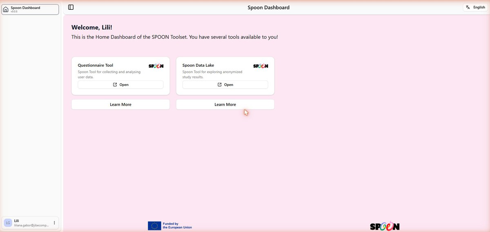
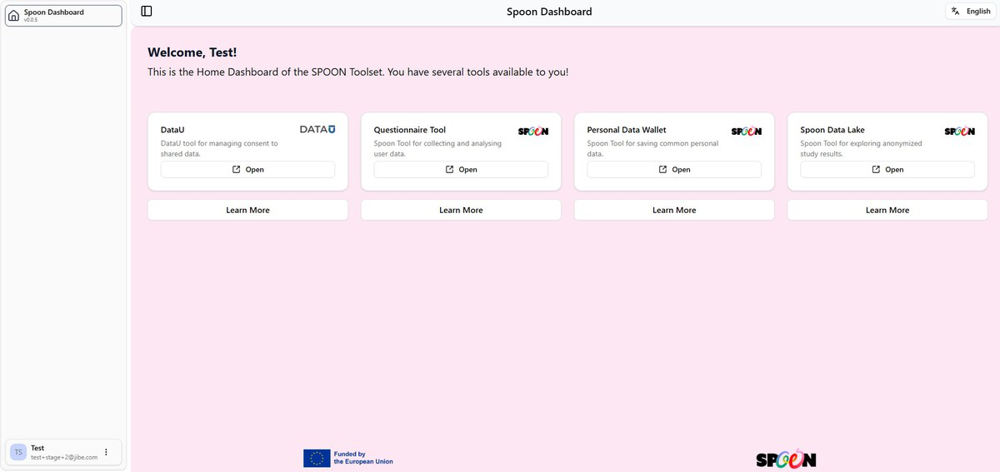

# SPOON Dashboard

## Overview

The **SPOON Dashboard** (v0.0.5) at [home.datau.jibe.cloud](https://home.datau.jibe.cloud) is the
single entry point for all users — both citizens and researchers. It is the common home for the
SPOON toolset.

After you log in with a DataU account, the Home Dashboard automatically displays **only the tools
relevant to your account role**. Everyone — researchers and citizens alike — uses the same URL and
login page.

## Getting started

### Accessing the Dashboard

1. Navigate to [https://home.datau.jibe.cloud](https://home.datau.jibe.cloud).
2. Click **Continue with DataU** to sign in with your DataU account.
3. New users: click **Register** to create a DataU account first.
4. After login you land on the Home Dashboard showing your available tools.

### Navigation

Use the sidebar toggle (**☰**, top-left) to expand or collapse the left navigation panel. The
sidebar shows the app name and version, your user profile (name, email, initials avatar), and links
to connected tools. You can change the language via the **English** button in the top-right corner.

## Available tools by role

The Dashboard shows different tool cards depending on your account role. Each card shows a
description, an **Open** button to launch the tool in a new tab, and a **Learn More** button for
additional information.

=== "Citizen / User account"

    - **DataU** — manage consent for shared data (dashboardu.datau.jibe.cloud)
    - **Questionnaire Tool** — view completed questionnaires (forms.datau.jibe.cloud)
    - **Personal Data Wallet** — manage and share personal data items (wallet.datau.jibe.cloud)
    - **Spoon Data Lake** — explore anonymised study results (lake.datau.jibe.cloud)

=== "Researcher / Admin account"

    - **Questionnaire Tool** — create and manage food-habits surveys (forms.datau.jibe.cloud)
    - **Spoon Data Lake** — explore anonymised study datasets (lake.datau.jibe.cloud)

!!! note "Figure 1.1 — SPOON Dashboard (researcher account) showing Questionnaire Tool and Data Lake"
    

!!! note "Figure 1.2 — SPOON Dashboard (citizen account) showing all four available tools"
    

## User profile & account

Your profile is shown at the bottom-left of the sidebar, displaying your **name**, **email address**, and an
**initials' avatar**. Click the **⋯** menu next to your name for account options including **logout**.

All SPOON tools share a **single sign-on** session managed by DataU using OpenID Connect (OIDC).
