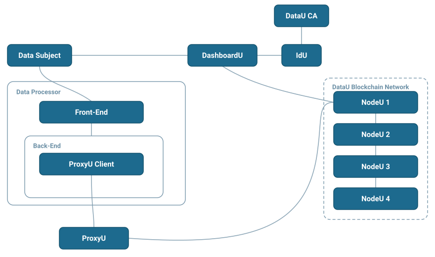

# ProxyU Client Guide

This section is for **Data Processors** — developers building applications on top of DataU that need
to request and receive personal data from data subjects, with consent and full traceability.

Your application never talks to citizens' data directly. Instead, it integrates with **ProxyU**, the
DataU integration bridge, using the **ProxyU Client**, to drive two core flows:

1. **Correlation** — link your application to a data subject's DataU identity.
2. **Permission** — request the subject's consent to access specific data, then receive that data
   through callbacks.

## Core concepts

- **Data subject** — the citizen who owns the data and grants (or revokes) consent, using
  [DashboardU](../data-subjects/dashboardu.md).
- **Data processor** — you: the application requesting and processing data.
- **ProxyU** — the per-tenant bridge your app connects to (over gRPC + mTLS) to run correlation and
  permission flows.
- **Correlation message** — a token your app generates and the subject consumes (via QR code or a
  DashboardU link) to establish the link between you and them.
- **Permission message** — a token that encodes a permission request for specific data.

## The correlation → permission flow

At a high level:

1. Your app creates a **correlation message** and shows it to the subject (QR code or DashboardU
   link).
2. The subject consumes it in DashboardU; your app receives their **public key** via a callback.
3. Your app creates a **permission message** for a specific data field and shows it to the subject.
4. The subject approves in DashboardU; your app receives the **granted status** and the **data** via
   callbacks.

## Get started

Pick the client that matches your stack.

-   :material-language-java: **[ProxyU Java Client](java-client/index.md)**

    ---

    The available client library. Add the SDK as a Maven dependency and wire it into your own JVM
    application.

    [:octicons-arrow-right-24: Java client guide](java-client/index.md)

-   :material-language-go: **[ProxyU Go Client](go-client.md)**

    ---

    Under construction — not released yet.

    [:octicons-arrow-right-24: Status](go-client.md)

-   :material-help-circle: **[Didn't find your language?](other-languages/index.md)**

    ---

    Run the Java application as a microservice, or generate your own gRPC client from
    `proxyu.proto`.

    [:octicons-arrow-right-24: Other languages](other-languages/index.md)

!!! question "Need access?"
    To integrate you'll need a ProxyU server endpoint and TLS certificates issued by the DataU CA.
    Contact **[datau.support@jibecompany.com](mailto:datau.support@jibecompany.com)** to get set up.
