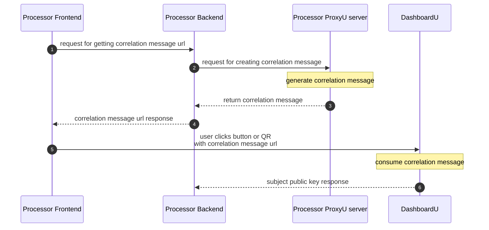
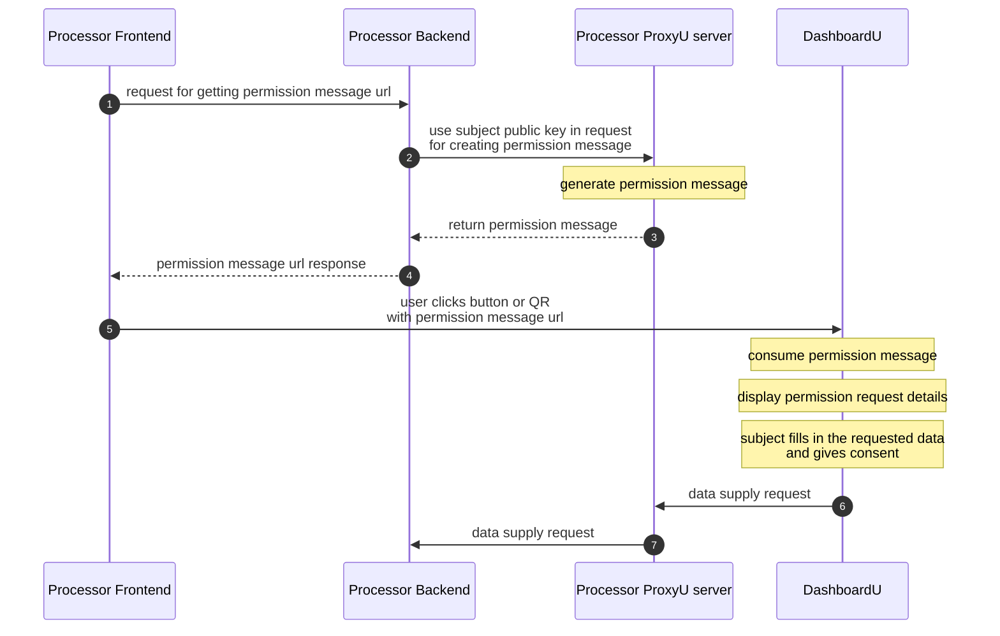

# ProxyU Java Client

The **ProxyU Java Client (SDK)** lets your JVM application integrate with the DataU platform:
correlate with data subjects, request permission for specific data, and receive that data through
callbacks — all over a secure gRPC + mTLS channel to a ProxyU instance.

!!! note "Requirements"
    - **Java 17**
    - A ProxyU server endpoint and TLS certificates issued by the DataU CA (contact
      [datau.support@jibecompany.com](mailto:datau.support@jibecompany.com)).

## Downloads

The current release is **1.1.0**.

| Package | File | |
| --- | --- | --- |
| **Java Client SDK** | `proxyu-java-client-SDK-1.1.0.zip` | [:octicons-download-24: Download](https://drive.google.com/file/d/1xah8T-gv79QoCUygfI050i6O96SHoYQf/view?usp=sharing) |
| **Demo application** | `proxyu-java-client-dp-demo-app-1.1.0.zip` | [:octicons-download-24: Download](https://drive.google.com/file/d/1V9xFg0TCM3_ftbY0rDSLWZ5N-Mv7o0zC/view?usp=sharing) |

## Integrate the SDK as a library

Integrate the SDK directly into your own application.

1. Copy the contents of [`proxyu-java-client-SDK-1.1.0.zip`](#downloads) to
   `~/.m2/repository/com/jibecompany/proxyu-java-client/1.1.0/`.

2. Add the Maven dependency:

    ```xml
    <!-- ProxyU Java SDK -->
    <dependency>
        <groupId>com.jibecompany</groupId>
        <artifactId>proxyu-java-client</artifactId>
        <version>${version}</version>
    </dependency>
    ```

3. Set these properties in your `application.properties`:

    ```properties
    proxyU.host=proxyu:9365            # FQDN and port of your proxyU instance
    proxyU.privateKey=path/to/proxyu.key
    proxyU.certificate=path/to/proxyu.pem
    proxyU.rootCertificate=path/to/root.crt
    ```

4. Implement the **`ProxyUClientStorage`** interface — provide your own custom DB implementation.
5. Implement the **`ProxyUClientCallbacks`** interface — provide behaviour for handling the received data.
6. Import **`ProxyUClientConfiguration`** in your configuration file and define the
   `proxyUClientStorage`, `proxyUClientCallbacks`, and `proxyUClient` beans:

    ```java
    @Bean
    ProxyUClientStorage proxyUClientStorage() {
        return new StorageService();
    }

    @Bean
    ProxyUClientCallbacks proxyUClientCallbacks() {
        return new ClientCallbacks();
    }

    @Bean
    ProxyUClient proxyUClient(
            ManagedChannel channel,
            ProxyUClientStorage proxyUClientStorage,
            ProxyUClientCallbacks proxyUClientCallbacks
    ) {
        return new ProxyUClient(channel, proxyUClientStorage, proxyUClientCallbacks);
    }
    ```

7. Inject `proxyUClient` in your service:

    ```java
    private final ProxyUClient proxyUClient;

    public DemoService(ProxyUClient proxyUClient) {
        this.proxyUClient = proxyUClient;
    }
    ```

Then use the client to drive the flows — see [SDK capabilities](#sdk-capabilities). The
[Demo Application](../demo-app.md) shows all of these integration steps in a working example.

## SDK capabilities

!!! warning "Respect parameter sizes"
    Make sure you respect the size limits of each parameter when calling the methods below. You can
    find the size of each parameter in the method's description in the Java documentation.

### Correlation

Correlation links your application to a data subject's DataU identity.



### Generating a correlation message

Use `proxyUClient#createCorrelationMessage` to create a correlation message.

To use the correlation message you have two options:

- **Option A** — Embed it in a **QR code** that your Data Subject will scan with the DashboardU app.
- **Option B** — Embed it in a **button** that will redirect the Data Subject to DashboardU:

    ```text
    $DASHBOARDU_BASE_URL/#/decode?message=URL_ENCODED_CORRELATION_MESSAGE
    ```

!!! example "Example"
    For this correlation message:

    ```text
    1kC0HYOItVV8gUNrdwCjYh1zw47IvQRdAIqZ3ukao0cDESPhhi/r8X5ZthJtFMZFXhYr6BC4qFht0x5evjAnBYT4g/NU1kcLqeOe4tHZXbBy6Yu21qO5EDojVlUQPUnWizw8d9nm3SXrcxb9N9ytdg==
    ```

    - On **STAGE**, the link would be:
      `https://dashboardu.datau-stage.jibe.cloud/#/decode?message=1kC0HYOItVV8gUNrdwCjYh1zw47IvQRdAIqZ3ukao0cDESPhhi%2Fr8X5ZthJtFMZFXhYr6BC4qFht0x5evjAnBYT4g%2FNU1kcLqeOe4tHZXbBy6Yu21qO5EDojVlUQPUnWizw8d9nm3SXrcxb9N9ytdg%3D%3D`
    - On **PROD**, the link would be:
      `https://dashboardu.datau.jibe.cloud/#/decode?message=1kC0HYOItVV8gUNrdwCjYh1zw47IvQRdAIqZ3ukao0cDESPhhi%2Fr8X5ZthJtFMZFXhYr6BC4qFht0x5evjAnBYT4g%2FNU1kcLqeOe4tHZXbBy6Yu21qO5EDojVlUQPUnWizw8d9nm3SXrcxb9N9ytdg%3D%3D`

!!! note "The correlation message MUST be URL-encoded."

Upon consuming the link, the correlation message is decoded and the correlation between the Data
Processor (you) and the Data Subject will take place and you will receive the result (the id of the user - their public key).

### Handling the result

- Implement the **`onPublicKeyReceived`** callback. Use it to save the `publicKey:correlationMessage`
  mapping for later use when generating permission-request messages, and to link the `publicKey` with
  a user via the `correlationMessage` received both here and in `proxyUClient#createCorrelationMessage`.
- A correlation message is valid **72 hours** from the moment it was generated.

### Redirecting the user back to your app

If you want you can redirect the user back to your app after they did the correlation in DashboardU add the `redirect_uri` query parameter to send the user back to your application:

```text
&redirect_uri=https%3A%2F%2Fgoogle.com
```

!!! note 
    The `redirect_uri` value **MUST be URL-encoded**. By default, the user is redirected in the same tab; add `&target=_blank` to open the URI in a new tab.


### Document submission

Submit a document with your **Terms & Conditions** for the permission request. The Data Subject will be able to consult this document when giving consent.

Use `proxyUClient#submitDocument` with a `LegalPolicyDocument` object containing:

- The **URL** where the document is stored. This must be a public URL (like a CDN or served by your app).
- The **SHA3-256 hash** of the document in Hex format.

!!! example
    For the document at
    `https://repo.maven.apache.org/maven2/springframework/spring-web/1.2.6/maven-metadata.xml`, the
    SHA3-256 hash in Hex would be
    `4025edc8feca5c9e7a387b78a4ff4b9860d7723039e4e269d177c384cfdc745d`.

### Permission

Permission requests the subject's consent to access specific data.



### Generating a permission message

Use `proxyUClient#createPermissionRequestMessage` to create a permission message. Its parameters:

| Parameter | How to build it                                                                                                                          |
| --- |------------------------------------------------------------------------------------------------------------------------------------------|
| **subject** | The ID of the Data Subject - public key received in `ClientCallbacks#onPublicKeyReceived` after the `correlation` flow is completed.     |
| **data** | The ID of the data type to request from the Data Subject - One of the UUIDs present in the Data Identification Graph. See details below. |
| **process** | Use `DataIdentificationGraphHelper#getProcessUUID` with `BULK` or `INDIVIDUAL` (see below).                                              |
| **policy** | The SHA3-256 file hash (Hex) of the Terms & Conditions document.                                                                         |
| **reason** | Optional — you can send a random UUID.                                                                                                   |
| **rewardPoints** | Number of points awarded to the Data Subject on granting consent. Set to `0` to skip rewards.                                            |

!!! tip "Getting the Data ID"

    The Data Identification Graph supports multiple data types, split in 2 categories:  
    Simple data types:  

    - **text/plain; charset=UTF-8**
    
    Composite data types:  

    - **application/datau+node**

    **A)** If you don't need to set a different data ID for each permission request, you can look at the Data Identification   
    Graph once by calling `TODO Dashboard didgraph link`, pick one of the IDs that suits you and use it directly in the permission message: 
    
    ``` ByteString data = ProxyUClientUtils.UUIDStringToByteString("0ee84dd4-90fe-4491-9943-733137753bed");
        ...
        demoService.createPermissionRequestMessage(
              subject, data,...
        );
    ```
    
    **B)** 
      Otherwise, if you need to set the data ID dynamically based on your needs, you can use
      `ProxyUClient#getDataIdentificationGraphRootNodes()` 
        to retrieve the current data types from the Data Identification Graph.
      Then use `proxyUClient.traverseAndGetAllDataNodes(dataIDGraphRootNodes);`  
        and filter the nodes based on your needs by  
      ```Proxyu.DataIDGraphNode#getKey()
        Proxyu.DataIDGraphNode#getMime()
      ```

**Process types:**

- **`BULK`** — request CSV files with multiple data values from a data subject.
- **`INDIVIDUAL`** — request single data values.

!!! note "BULK metadata fields"
    On the `BULK` flow, the shared file must contain the metadata fields `user_id` and `date_time`.

### Using the permission message

As with correlation, use it via a QR code (**Option A**) or a DashboardU link (**Option B**):

```text
$DASHBOARDU_BASE_URL/#/decode?message=URL_ENCODED_PERMISSION_MESSAGE
```

!!! note
    The permission message **MUST be URL-encoded**.

Upon consuming the link, the permission message is decoded into a permission request for the data you
created it for.

### Handling the result

- Implement the **`onGrantedStatusReceived`** callback. Use it to save the `granted:permissionMessage`
  mapping, so you can later link the granted status with a user via the `permissionMessage` received
  both here and in `proxyUClient#createPermissionRequestMessage`.
- A permission message is valid **72 hours** from the moment it was generated.

### Redirecting the user back to your app

If you want you can redirect the user back to your app after they approved/denied the permission in DashboardU,
add the `redirect_uri` query parameter to send the user back to your application:

```text
&redirect_uri=https%3A%2F%2Fgoogle.com
```

!!! note
The `redirect_uri` value **MUST be URL-encoded**. By default, the user is redirected in the same tab; add `&target=_blank` to open the URI in a new tab.
