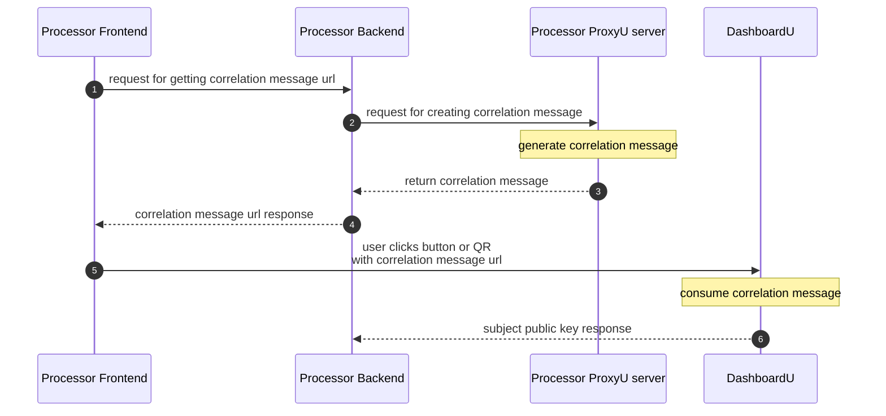
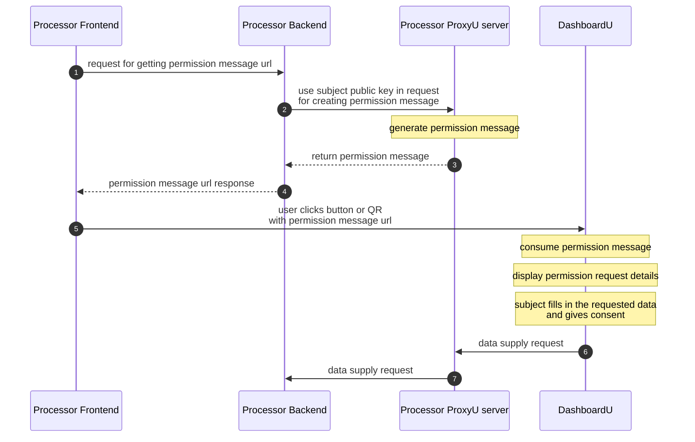
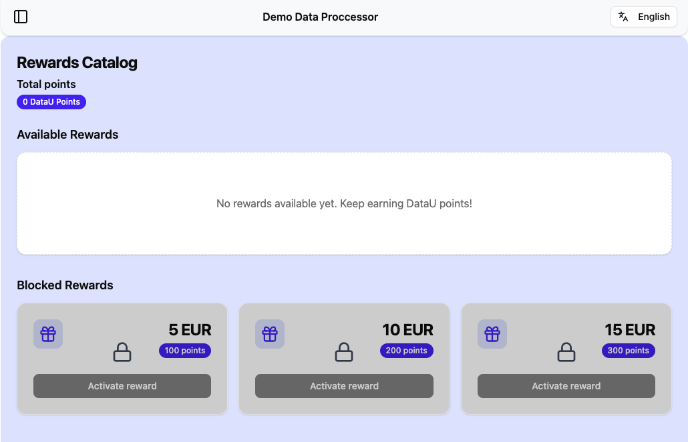
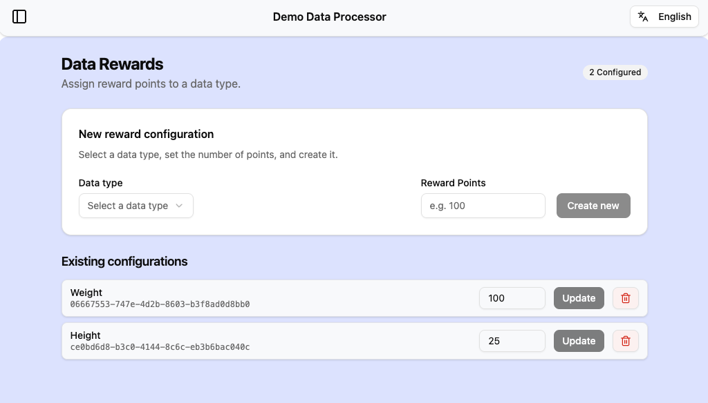

# ProxyU Java Client

!!! info "SDK 2.0.0 — latest"
    You are reading the documentation for **ProxyU Java Client 2.0.0**, the current release.

    Still on an older SDK? See [previous versions](#previous-versions).

The **ProxyU Java Client (SDK)** lets your JVM application integrate with the DataU platform:
correlate with data subjects, request permission for specific data, and receive that data through
callbacks — all over a secure gRPC + mTLS channel to a ProxyU instance.

!!! note "Requirements"
    - **Java 17**
    - A ProxyU server endpoint and TLS certificates issued by the DataU CA (contact
      [datau.support@jibecompany.com](mailto:datau.support@jibecompany.com)).

## Downloads

The current release is **2.0.0**.

| Package | File | |
| --- | --- | --- |
| **Java Client SDK** | `proxyu-java-client-SDK-2.0.0.zip` | [:octicons-download-24: Download](https://drive.google.com/file/d/1IZ4fs0QJ6CasheCV1fpraXRzZQC0O7Cw/view?usp=sharing) |
| **Demo application** | `proxyu-java-client-dp-demo-app-2.0.0.zip` | [:octicons-download-24: Download](https://drive.google.com/file/d/1tvhUEgBUw5o6OEDu7Ty5wMgHjd9DQoUn/view?usp=sharing) |

## Integrate the SDK as a library

Integrate the SDK directly into your own application.

1. Copy the contents of [`proxyu-java-client-SDK-2.0.0.zip`](#downloads) to
   `~/.m2/repository/com/jibecompany/proxyu-java-client/2.0.0/`.

2. Add the Maven dependency:

    ```xml
    <!-- ProxyU Java SDK -->
    <dependency>
        <groupId>com.jibecompany</groupId>
        <artifactId>proxyu-java-client</artifactId>
        <version>${version}</version>
    </dependency>
    ```

3. Set these properties in your `application.properties`:

    ```properties
    proxyU.host=proxyu:9365            # FQDN and port of your proxyU instance
    proxyU.privateKey=path/to/proxyu.key
    proxyU.certificate=path/to/proxyu.pem
    proxyU.rootCertificate=path/to/root.crt
    ```

4. Implement the **`ProxyUClientStorage`** interface — provide your own custom DB implementation.
5. Implement the **`ProxyUClientCallbacks`** interface — provide behaviour for handling the received data.
6. Import **`ProxyUClientConfiguration`** in your configuration file and define the
   `proxyUClientStorage`, `proxyUClientCallbacks`, and `proxyUClient` beans:

    ```java
    @Bean
    ProxyUClientStorage proxyUClientStorage() {
        return new StorageService();
    }

    @Bean
    ProxyUClientCallbacks proxyUClientCallbacks() {
        return new ClientCallbacks();
    }

    @Bean
    ProxyUClient proxyUClient(
            ManagedChannel channel,
            ProxyUClientStorage proxyUClientStorage,
            ProxyUClientCallbacks proxyUClientCallbacks
    ) {
        return new ProxyUClient(channel, proxyUClientStorage, proxyUClientCallbacks);
    }
    ```

7. Inject `proxyUClient` in your service:

    ```java
    private final ProxyUClient proxyUClient;

    public DemoService(ProxyUClient proxyUClient) {
        this.proxyUClient = proxyUClient;
    }
    ```

Then use the client to drive the flows — see [SDK capabilities](#sdk-capabilities). The
[Demo Application](../demo-app.md) shows all of these integration steps in a working example.

## Public API

| Type | Purpose |
| --- | --- |
| `ProxyUClient` | Entry point — correlation, document submission, permission requests, graph traversal |
| `ProxyUClientConfiguration` | Spring configuration; builds the mTLS `ManagedChannel` |
| `ProxyUClientStorage` | **You implement this** — persistence for client state |
| `ProxyUClientCallbacks` | **You implement this** — inbound public keys, granted status, data |
| `ProxyUClientUtils` | Static helpers — UUID/`ByteString` conversion, MIME-type constants, reading files as `UserData` |
| `CorrelationMessage`, `PermissionMessage` | Generated message wrappers |
| `LegalPolicyDocument` | Terms & Conditions URL + SHA3-256 hash |
| `DataIdentificationGraph`, `DataIdentificationGraphNode` | Data Identification Graph model |
| `UserData` | Data received from a data subject |

### `ProxyUClient` methods

| Method | Purpose |
| --- | --- |
| `createCorrelationMessage()` | Start the correlation flow; returns the message to encode in a QR code or DashboardU link |
| `submitDocument(LegalPolicyDocument)` | Register your Terms & Conditions (public URL + SHA3-256 hash) |
| `createPermissionRequestMessage(...)` | Request consent for a specific data type |
| `getDataIdentificationGraphRootNodes()` | Fetch the root nodes of the Data Identification Graph |
| `getDataIdentificationGraphDotRepresentation()` | The whole graph as Graphviz DOT source, for inspecting it by eye |
| `traverseAndGetAllDataNodes(...)` / `traverseAndGetAllNodesByType(...)` | Flatten the graph so you can filter nodes by key or MIME type |

## SDK capabilities

!!! warning "Respect parameter sizes"
    Make sure you respect the size limits of each parameter when calling the methods below. You can
    find the size of each parameter in the method's description in the Java documentation.

### Correlation

Correlation links your application to a data subject's DataU identity.



### Generating a correlation message

Use `proxyUClient#createCorrelationMessage` to create a correlation message.

To use the correlation message you have two options:

- **Option A** — Embed it in a **QR code** that your Data Subject will scan with the DashboardU app.
- **Option B** — Embed it in a **button** that will redirect the Data Subject to DashboardU:

    ```text
    $DASHBOARDU_BASE_URL/#/decode?message=URL_ENCODED_CORRELATION_MESSAGE
    ```

!!! example "Example"
    For this correlation message:

    ```text
    1kC0HYOItVV8gUNrdwCjYh1zw47IvQRdAIqZ3ukao0cDESPhhi/r8X5ZthJtFMZFXhYr6BC4qFht0x5evjAnBYT4g/NU1kcLqeOe4tHZXbBy6Yu21qO5EDojVlUQPUnWizw8d9nm3SXrcxb9N9ytdg==
    ```

    - On **STAGE**, the link would be:
      `https://dashboardu.datau-stage.jibe.cloud/#/decode?message=1kC0HYOItVV8gUNrdwCjYh1zw47IvQRdAIqZ3ukao0cDESPhhi%2Fr8X5ZthJtFMZFXhYr6BC4qFht0x5evjAnBYT4g%2FNU1kcLqeOe4tHZXbBy6Yu21qO5EDojVlUQPUnWizw8d9nm3SXrcxb9N9ytdg%3D%3D`
    - On **PROD**, the link would be:
      `https://dashboardu.datau.jibe.cloud/#/decode?message=1kC0HYOItVV8gUNrdwCjYh1zw47IvQRdAIqZ3ukao0cDESPhhi%2Fr8X5ZthJtFMZFXhYr6BC4qFht0x5evjAnBYT4g%2FNU1kcLqeOe4tHZXbBy6Yu21qO5EDojVlUQPUnWizw8d9nm3SXrcxb9N9ytdg%3D%3D`

!!! note "The correlation message MUST be URL-encoded."

Upon consuming the link, the correlation message is decoded and the correlation between the Data
Processor (you) and the Data Subject will take place and you will receive the result (the id of the user - their public key).

### Handling the result

- Implement the **`onPublicKeyReceived`** callback. Use it to save the `publicKey:correlationMessage`
  mapping for later use when generating permission-request messages, and to link the `publicKey` with
  a user via the `correlationMessage` received both here and in `proxyUClient#createCorrelationMessage`.
- A correlation message is valid **72 hours** from the moment it was generated.

### Redirecting the user back to your app

If you want you can redirect the user back to your app after they did the correlation in DashboardU add the `redirect_uri` query parameter to send the user back to your application:

```text
&redirect_uri=https%3A%2F%2Fgoogle.com
```

!!! note 
    The `redirect_uri` value **MUST be URL-encoded**. By default, the user is redirected in the same tab; add `&target=_blank` to open the URI in a new tab.


### Document submission

Submit a document with your **Terms & Conditions** for the permission request. The Data Subject will be able to consult this document when giving consent.

Use `proxyUClient#submitDocument` with a `LegalPolicyDocument` object containing:

- The **URL** where the document is stored. This must be a public URL (like a CDN or served by your app).
- The **SHA3-256 hash** of the document in Hex format.

!!! example
    For the document at
    `https://repo.maven.apache.org/maven2/springframework/spring-web/1.2.6/maven-metadata.xml`, the
    SHA3-256 hash in Hex would be
    `4025edc8feca5c9e7a387b78a4ff4b9860d7723039e4e269d177c384cfdc745d`.

### Permission

Permission requests the subject's consent to access specific data.



### Generating a permission message

Use `proxyUClient#createPermissionRequestMessage` to create a permission message. Its parameters:

| Parameter | How to build it                                                                                                                         |
| --- |-----------------------------------------------------------------------------------------------------------------------------------------|
| **subject** | The ID of the Data Subject - public key received in `ClientCallbacks#onPublicKeyReceived` after the `correlation` flow is completed.    |
| **data** | The ID of the data type to request from the Data Subject - One of the UUIDs present in the Data Identification Graph. [See below](#getting-the-data-id). |
| **process** | Not yet implemented — you can send a random UUID.                                                                                            |
| **policy** | The SHA3-256 file hash (Hex) of the Terms & Conditions document.                                                                        |
| **reason** | Not yet implemented — you can send a random UUID.                                                                                       |
| **rewardPoints** | Number of points awarded to the Data Subject on granting consent. Set to `0` to skip rewards.                                           |

#### Getting the Data ID

Every data field you can request is registered in the **Data Identification Graph**, stored on the
blockchain. Each node in the graph has a UUID, and that UUID is the `data` parameter above.

The graph holds two categories of data type:

| Category | MIME type                   |
| --- |-----------------------------|
| Simple | `text/plain; charset=UTF-8` |
| Simple | `text/csv; charset=UTF-8`   |
| Simple | `image/*`                   |
| Composite | `application/datau+node`    |

How you get the ID depends on whether it is fixed or varies per request:

=== "A — one fixed data ID"

    If every permission request asks for the same data, inspect the graph once and use the UUID
    directly.

    Call `proxyUClient#getDataIdentificationGraphDotRepresentation` to get the graph as
    [DOT](https://graphviz.org/doc/info/lang.html) source, then render it in any Graphviz viewer —
    for example [GraphvizOnline](https://dreampuf.github.io/GraphvizOnline) or
    [Edotor](https://edotor.net).

    Pick the ID you need and pass it to the permission message:

    ```java
    ByteString data = ProxyUClientUtils.UUIDStringToByteString("0ee84dd4-90fe-4491-9943-733137753bed");
    // ...
    demoService.createPermissionRequestMessage(subject, data, ...);
    ```

=== "B — data ID chosen at runtime"

    If the data ID varies, read the graph through the API instead.

    1.  Fetch the root nodes, then flatten them so you can filter:

        ```java
        List<Proxyu.DataIDGraphNode> roots = proxyUClient.getDataIdentificationGraphRootNodes();

        // every data node in the graph
        Map<String, Proxyu.DataIDGraphNode> all =
                proxyUClient.traverseAndGetAllDataNodes(roots);

        // only the nodes of one MIME type
        Map<String, Proxyu.DataIDGraphNode> simple =
                proxyUClient.traverseAndGetAllNodesByType(roots, "text/plain; charset=UTF-8");
        ```

    2.  Filter on `Proxyu.DataIDGraphNode#getKey` or `Proxyu.DataIDGraphNode#getMime` to find the
        node you want.

    3.  Convert that node's UUID with `ProxyUClientUtils#UUIDStringToByteString` and pass it as
        `data`.

### Using the permission message

As with correlation, use it via a QR code (**Option A**) or a DashboardU link (**Option B**):

```text
$DASHBOARDU_BASE_URL/#/decode?message=URL_ENCODED_PERMISSION_MESSAGE
```

!!! note
    The permission message **MUST be URL-encoded**.

Upon consuming the link, the permission message is decoded into a permission request for the data you
created it for.

### Handling the result

- Implement the **`onGrantedStatusReceived`** callback. Use it to save the `granted:permissionMessage`
  mapping, so you can later link the granted status with a user via the `permissionMessage` received
  both here and in `proxyUClient#createPermissionRequestMessage`.
- A permission message is valid **72 hours** from the moment it was generated.

### Redirecting the user back to your app

If you want you can redirect the user back to your app after they approved/denied the permission in DashboardU,
add the `redirect_uri` query parameter to send the user back to your application:

```text
&redirect_uri=https%3A%2F%2Fgoogle.com
```

!!! note
    The `redirect_uri` value **MUST be URL-encoded**. By default, the user is redirected in the same tab; add `&target=_blank` to open the URI in a new tab.


## Using the Reward Mechanism

Reward points let you credit a Data Subject for granting a permission, and let them spend those
points in a rewards catalog you host.

1.  Set `rewardPoints` to the number of points to award when you create the permission message.
    Set it to `0` to skip rewards for that request.

2.  When the Data Subject grants the permission, the SDK calls
    `onGrantedStatusReceived(boolean granted, PermissionMessage permissionMessage)`. Read the points
    off the message and credit the user:

    ```java
    public void onGrantedStatusReceived(boolean permissionGranted, PermissionMessage permissionMessage) {
        // persist the granted status for data X for user Y
        // ...

        // reward logic
        if (permissionGranted) {
            awardRewardPoints(permissionMessage);
        }
    }

    private void awardRewardPoints(PermissionMessage permissionMessage) {
        int rewardPoints = permissionMessage.getRewardPoints();
        if (rewardPoints <= 0) {
            return;
        }

        userRepository.findOneByDataUSubjectId(permissionMessage.getB64SubjectPublicKey()).ifPresentOrElse(
            user -> {
                int currentPoints = user.getDatauPoints() != null ? user.getDatauPoints() : 0;
                user.setDatauPoints(currentPoints + rewardPoints);
                userRepository.save(user);
            },
            () -> logger.log(
                Level.INFO, "Could not find user to award reward points for DataU subject: " +
                permissionMessage.getB64SubjectPublicKey()
            )
        );
    }
    ```

3.  Implement a rewards catalog page at `https://your.application.com/rewards-catalog`, where the
    Data Subject can spend their points. DataU (DashboardU) will display that URL, so Data Subjects can explore
    the rewards you offer for their accumulated points.

    !!! note "Data Processor Rewards Catalog Example"
        

    If you want to offer different points for different data, add a rewards configurator to your
    app that stores a points-per-data-type (UUID) configuration in your database. When you create a
    permission request for that data type, look up the configured points and set `rewardPoints`
    accordingly.

    !!! note "Data Processor Rewards Configurator Example"
        

4.  When a Data Subject redeems a reward, subtract the consumed amount from their available points
    in your database.

## Previous versions

Documentation for superseded SDK releases is kept online so existing integrations stay supported.
These pages are frozen at the release they document and are not updated.

| SDK version | Status | Documentation |
| --- | --- | --- |
| **2.0.0** | Current | This page |
| 1.1.0 | Archived | [ProxyU Java Client 1.1.0](v1.1.0.md) |
