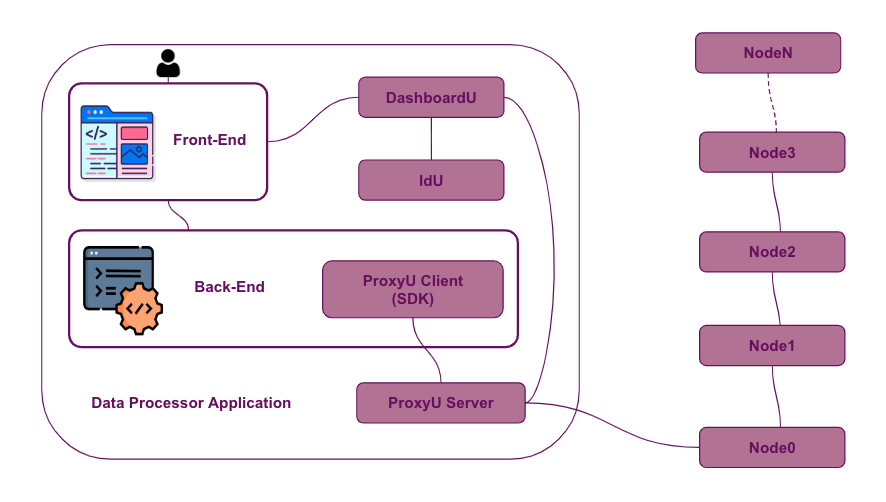

# ProxyU Java SDK

The **ProxyU Java client (SDK)** lets your JVM application integrate with the DataU platform: correlate
with data subjects, request permission for specific data, and receive that data through callbacks —
all over a secure gRPC + mTLS channel to a ProxyU instance.

There are three ways to integrate, depending on how much control you need.

## Choose an integration approach

=== "Approach 1 — Deploy the demo app"

    Deploy the provided **Spring Boot demo application** as a microservice. It already integrates and
    exposes the SDK's capabilities through REST endpoints. Run it on Docker or directly on your server
    from the runnable jar.

    Best when you want the fastest path to a working integration and are happy to adapt the exposed
    endpoints to your needs.

    [:octicons-arrow-right-24: Demo Application guide](demo-app.md)

=== "Approach 2 — Integrate the SDK as a library"

    Add the SDK as a Maven dependency and wire it into your own Spring application: implement the
    storage and callback interfaces, define the beans, and inject the client into your services.

    Best when you're building your own JVM application and want full control over persistence and
    behaviour.

    [:octicons-arrow-right-24: Getting Started guide](getting-started.md)

=== "Approach 3 — Build your own SDK"

    If neither Java approach suits you, generate a gRPC client from the `proxyu.proto` protocol file
    in your backend's preferred language, using the provided SDK as a reference implementation.

    Best when your stack isn't JVM-based. See [Getting Started → Build your own SDK](getting-started.md#approach-3-build-your-own-sdk).

## What's in this guide

- **[Getting Started](getting-started.md)** — install the SDK, configure `application.properties`,
  implement the interfaces, and define the beans.
- **[SDK Capabilities](capabilities.md)** — correlation, document submission, and permission flows in
  detail.
- **[Demo Application](demo-app.md)** — run the Docker-based demo, its REST endpoints, and the full
  user journey.
- **[Troubleshooting](troubleshooting.md)** — common errors and their fixes.

!!! note "Requirements"
    - **Java 17**
    - A ProxyU server endpoint and TLS certificates issued by the DataU CA (contact
      [datau.support@jibecompany.com](mailto:datau.support@jibecompany.com)).
