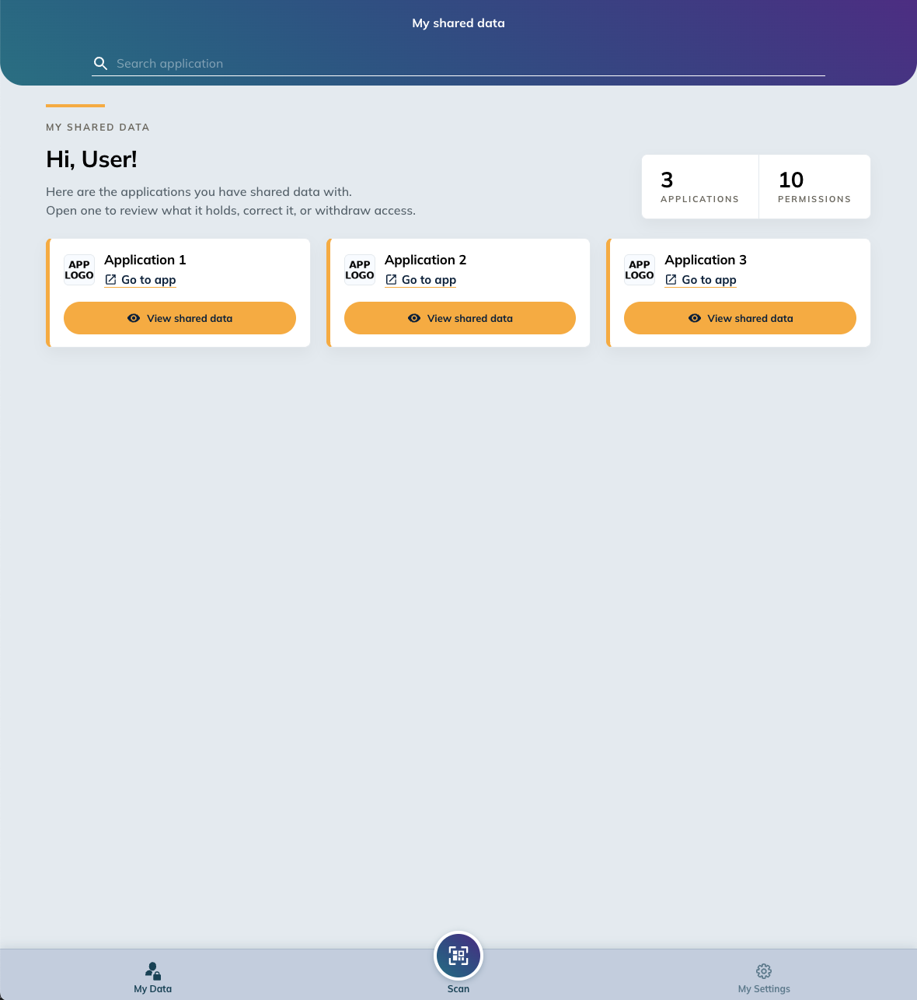
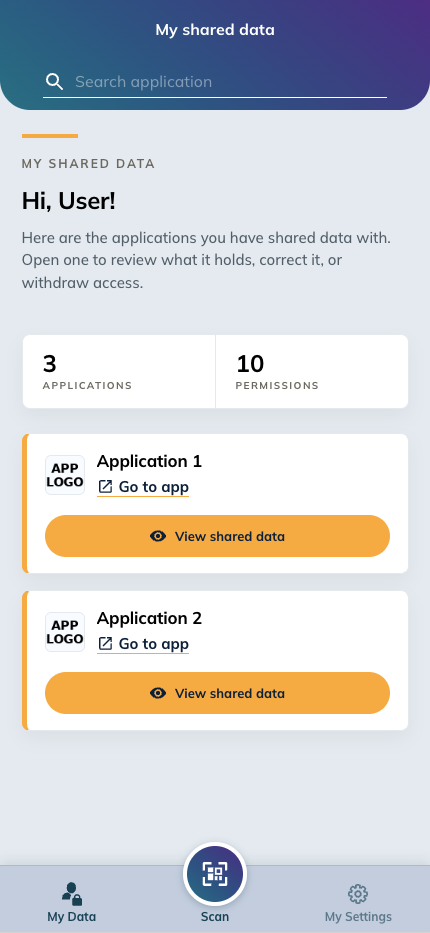
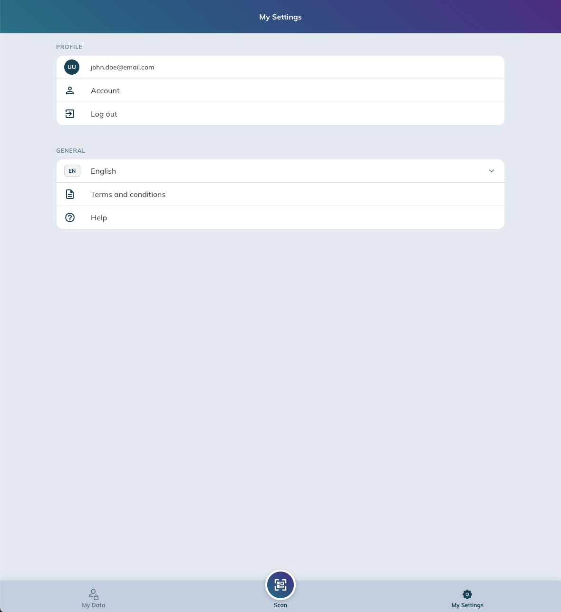
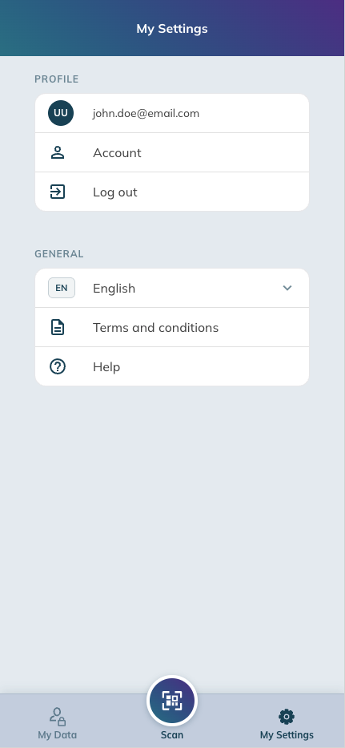
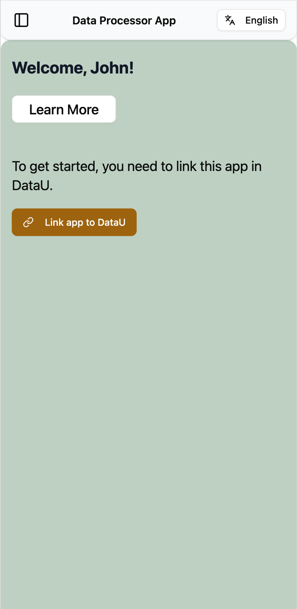
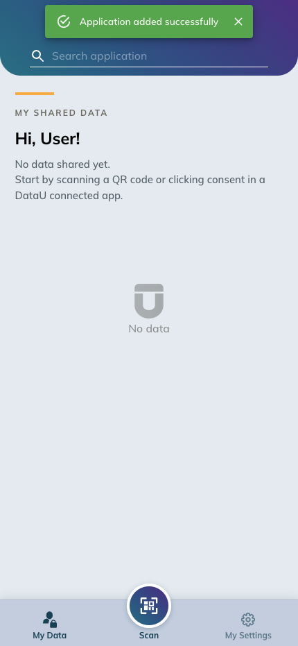
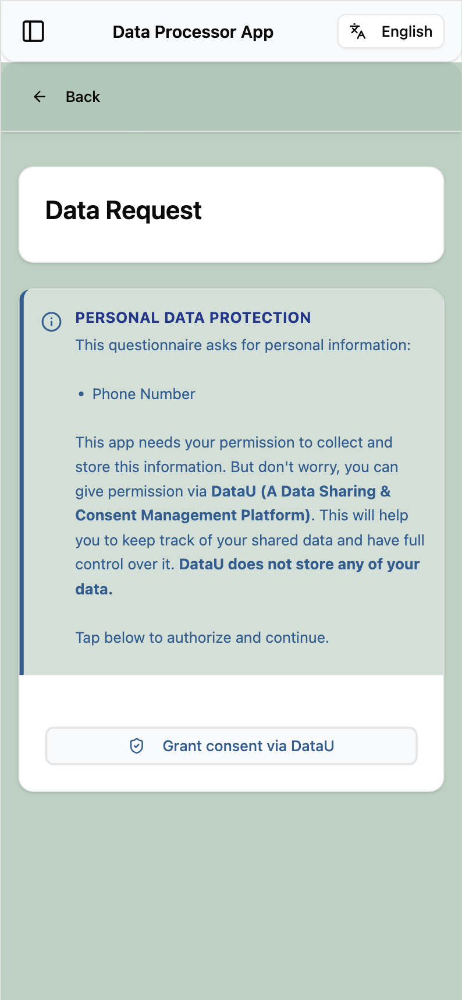
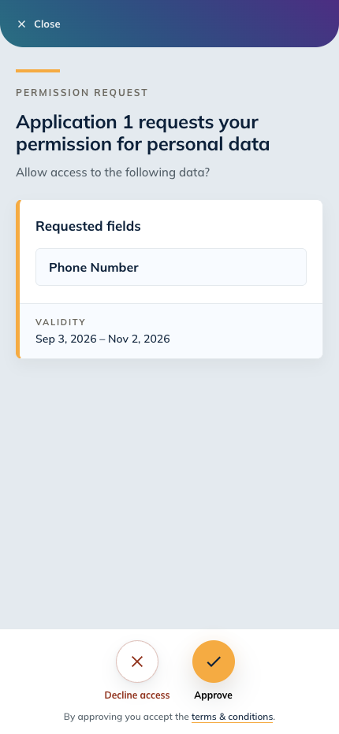

# DashboardU User Guide

**DashboardU** is the DataU Dashboard where you can control and monitor how your data is shared.

## Sign up - Registering a new account

1. Go to [dashboardu.datau.jibe.cloud](https://dashboardu.datau.jibe.cloud), click **Sign in**.
2. Click **Register**
3. Complete the registration form.
4. Verify your email address.
5. Sign in with your new credentials.

## Sign in

1. Go to [dashboardu.datau.jibe.cloud](https://dashboardu.datau.jibe.cloud), click **Sign in**.
2. You are redirected to the DataU Sign in page.
3. Enter your credentials and click **Sign in**.
4. You can now start sharing data with any DataU-connected applications.

## My Data

Shows all applications you have shared data with. Use the **Search application** field to filter.
Each entry shows *what* data was shared. It displays **"No data"** when no sharing has
occurred yet.

!!! note "My Data view"
    { width="65%" }
    { width="33%" }
    { .dx-pair-row }

## My Settings

- **Language** — change the display language.
- **Terms and conditions** — view the platform T&Cs.
- **Help** — access support documentation.
- **Log out** — sign out of DataU.

!!! note "My Settings view"
    { width="65%" }
    { width="33%" }
    { .dx-pair-row }

## Starting to Share Data

To start sharing data, scan the QR code or follow the consent instructions found in a DataU-connected application.

!!! tip "Step 1: Correlation"
    When a connected app asks to correlate (link) with you, you'll
    open a link that will redirect you to DashboardU. DashboardU decodes the
    request and allows you to connect to the new app. 
    This step needs to be done only once per application (Data Processor).

{ width="95%" }

!!! tip "Step 2: Permission"
    After correlating (linking) with a Data Processor, the connected app can request a permission for some data from you.
    You'll open a link that lands in DashboardU. DashboardU decodes the
    request and lets you approve or deny it.

## Privacy & data sovereignty

DataU is built on a data-sovereignty model — you are an active participant who decides how your data
is used:

- **Consent-based collection** — data is shared only with your explicit consent when you approve a request.
- **GDPR compliance** — the platform is designed to meet EU data-protection regulations and
  European data-governance standards.
