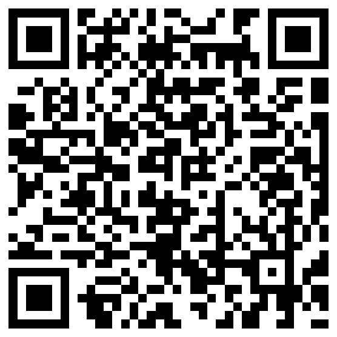
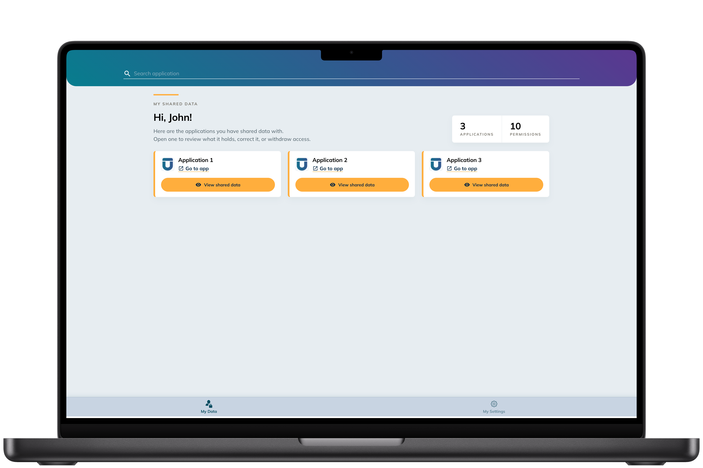
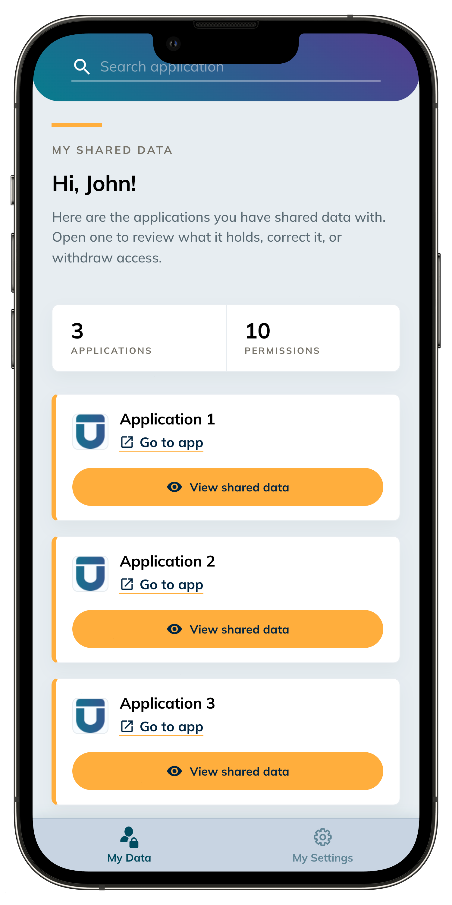
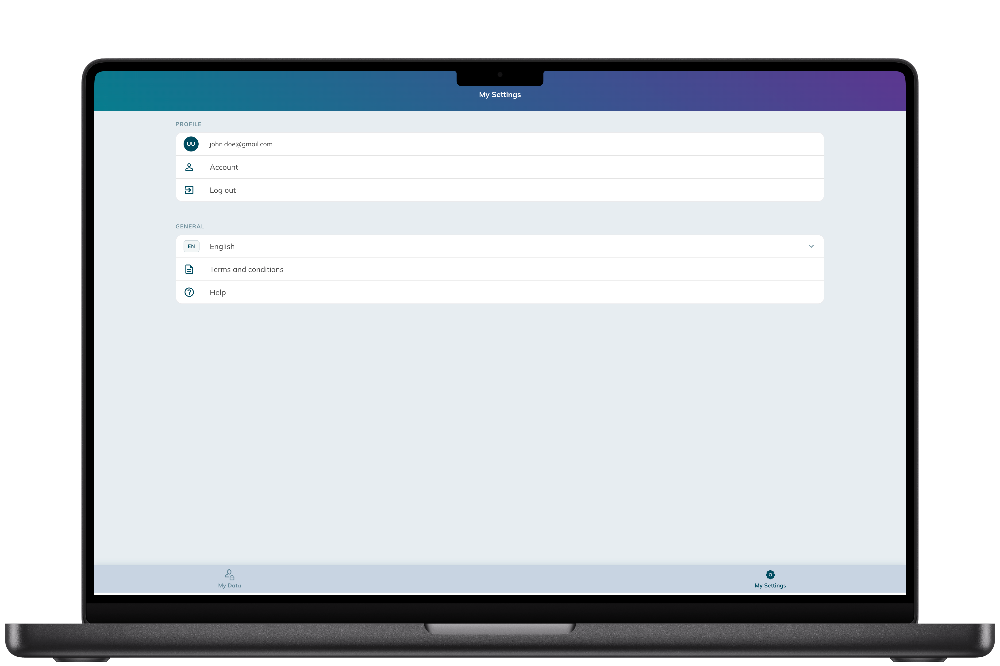
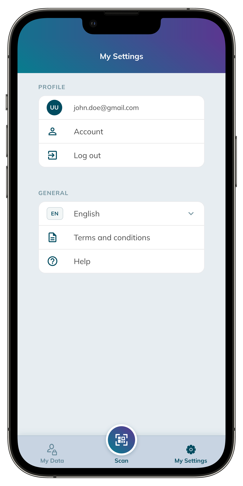
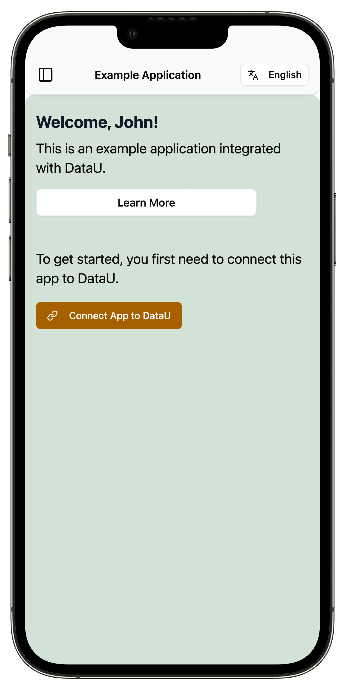
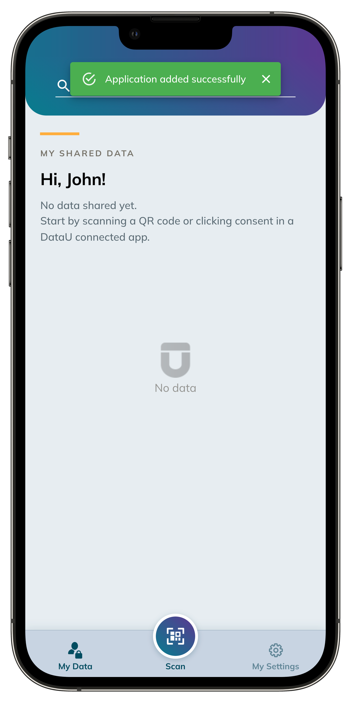
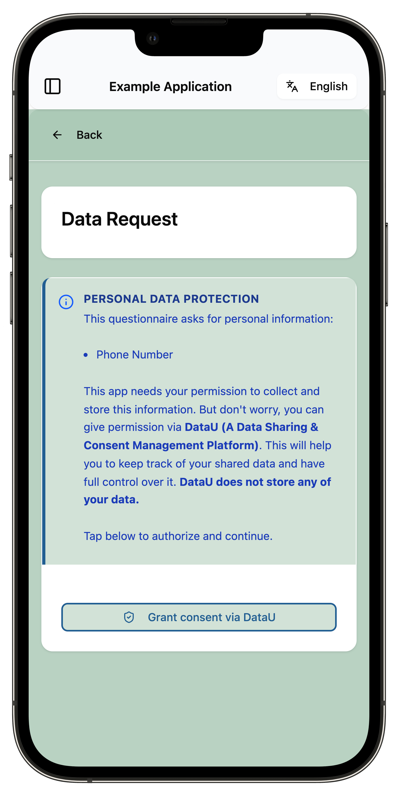
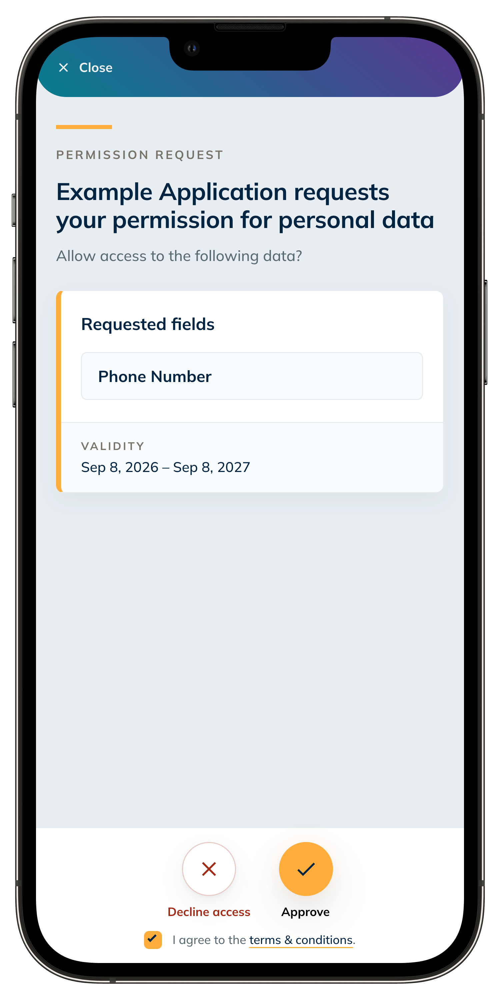

# DashboardU User Guide

**DashboardU** is the DataU Dashboard where you can control and monitor how your data is shared.   
## **_Available on Mobile & Web._**

To install it on a mobile device follow these steps:

!!! info dx-fit "Scan the QR code with your phone camera"
    { width="260" }

## IOS

**Share button |↑| → "Add to Home Screen"**

## Android

**Menu button ⋮  → "Add to Home Screen" or "Install app"**

## Sign up - Registering a new account

1. Go to [dashboardu.datau.jibe.cloud](https://dashboardu.datau.jibe.cloud) on web or open the app on your phone, click **Sign in**.
2. Click **Register**
3. Complete the registration form.
4. Verify your email address.
5. Sign in with your new credentials.

## Sign in

1. Go to [dashboardu.datau.jibe.cloud](https://dashboardu.datau.jibe.cloud), click **Sign in**.
2. You are redirected to the DataU Sign in page.
3. Enter your credentials and click **Sign in**.
4. You can now start sharing data with any DataU-connected applications.

## My Data

Shows all applications you have shared data with. Use the **Search application** field to filter.
Each entry shows *what* data was shared. It displays **"No data"** when no sharing has
occurred yet.

!!! info "My Data view"
    { width="75%" }
    { width="23%" }
    { .dx-pair-row }

## My Settings

- **Language** — change the display language.
- **Terms and conditions** — view the platform T&Cs.
- **Help** — access DataU tutorial.
- **Log out** — sign out of DataU.

!!! info "My Settings view"
    { width="75%" }
    { width="23%" }
    { .dx-pair-row }

## Starting to Share Data

To start sharing data, scan the **QR code** with the DataU App or **follow the instructions** provided in the application you want to share data with.

!!! tip "Step 1: Connect App to DataU"
    This step needs to be done only once per application.
    Scan the **QR code** with the DataU app **OR** click the '**Connect to DataU**' button.   
    DataU will open and the new app will be connected. 
    

{ width="65%" }

{ width="65%" }

!!! tip "Step 2: Permission Request"
    After a successful connection, the app will request a permission for some data.
    Scan the permission **QR code** with the DataU app **OR** click the '**Consent**' button.  
    A permission request will be displayed in DataU. **Approve** or **Deny** it.

{ width="65%" }

{ width="65%" }

## Privacy & data sovereignty

DataU is built on a data-sovereignty model — you are an active participant who decides how your data
is used:

- **Consent-based collection** — data is shared only with your explicit consent when you approve a request.
- **GDPR compliance** — the platform is designed to meet EU data-protection regulations and
  European data-governance standards.
